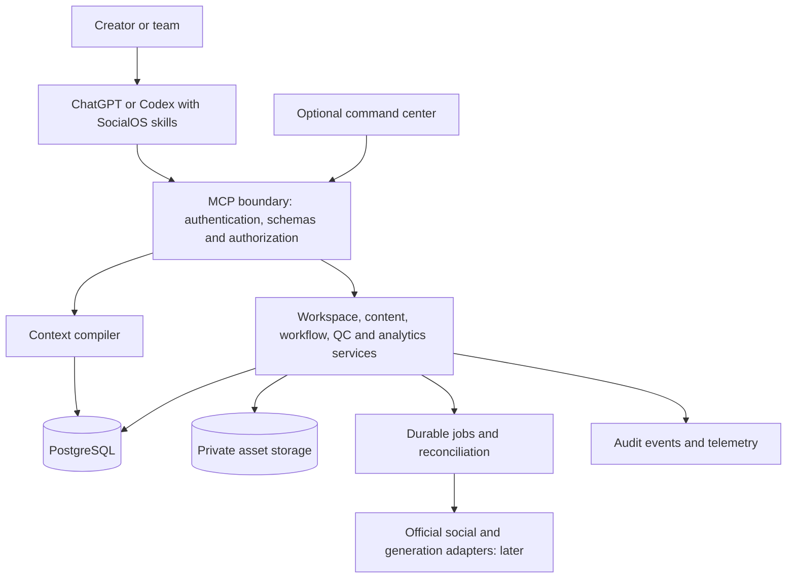

# SocialOS — Analysis and Implementation Plan

Prepared 29 September 2026. Status: proposed product and engineering baseline; implementation has not started.

## 1. Recommendation

Build SocialOS as a conversational content operations product with persistent brand context, versioned content, resumable workflows, production specifications, and evidence-based learning. Use a modular backend exposed through MCP, accompanied by focused skills and an optional user interface.

The first complete user journey should be:

**Create a brand workspace → develop a content brief → produce two platform variants → review and export → resume in another conversation → import actual results → propose an experiment.**

This journey proves the central promise: decisions and creative work survive beyond a chat, and future recommendations use evidence from previous work.

Start with a private alpha, expand to a production V1 beta, then add official account integrations and controlled publishing. Keep AI video planning in scope; distinguish producing a generation-ready package from actually rendering and editing video.

## 2. What the two documents contribute

The first document, “Universal Social Media Intelligence & Content Operating System,” defines the product's operating principles and desired behavior. The second document proposes translating those principles into skills, MCP tools, durable storage, workflows, analytics, and integrations.

| Area | Assessment | Planning consequence |
|---|---|---|
| Audience value, trust, business objectives | Strong and consistent | Turn these into content review criteria and product success measures |
| Persistent state and explicit knowledge types | Essential | Store facts, assumptions, decisions, hypotheses, results, and learnings with provenance |
| Master content with platform variants | Strong core abstraction | Make revision lineage and variant independence explicit |
| Tool-neutral creative specifications | Valuable for AI production | Separate creative requirements from provider parameters |
| Skills plus deterministic backend | Sound division of responsibility | Keep reasoning in the host; enforce permissions and invariants in code |
| Context compiler | Useful, but underspecified | Define retrieval precedence, access filtering, freshness, and context budgets |
| Workflow resume | Essential, but status lists are insufficient | Implement durable steps, checkpoints, dependencies, retries, and revision invalidation |
| Analytics and experimentation | Conceptually strong | Define metric semantics, denominators, comparison windows, and evidence thresholds |
| V1 scope | Too broad for one initial milestone | Separate private alpha, V1 beta, integrations, and publishing |
| Security and evaluation | Correct requirements, introduced too late in build sequence | Start both with the first persistent tool |
| Universal platform support | Valid architectural ambition | Use extensible platform identifiers, but certify only tested capabilities |
| Agent specialization | Optional technique | Begin with modular skills; add separate agents only when evaluations demonstrate value |

The pasted second document contains citation placeholders such as `:chatgpt-content-reference{...}`. These are not usable source links. Treat its external claims as unverified until checked against actual documentation.

### Corrections and additions

1. **Scheduling is consequential.** A scheduled post becomes public later. Apply the same authorization standard as immediate publishing, including for material schedule or payload changes.
2. **“Approved” must refer to a revision.** Approving a script does not approve later changes, another account, or a newly substituted asset.
3. **Saving is not factual endorsement.** Save drafts and observations within authorized workflows; separately record whether a strategic decision or claimed learning was accepted.
4. **A generic workflow update must not bypass policy.** The server checks prerequisites before advancing a step or marking an item ready.
5. **Missing data is not zero.** Unknown, unsupported, unavailable, and not applicable need distinct representations.
6. **Platform guidance and platform execution are different adapters.** A platform can support planning before any social account is connected.
7. **Resumability is not unattended reasoning.** Background reasoning needs a separately configured execution runtime and budget. A persisted workflow alone does not run after the conversation ends.
8. **Do not promise identical host behavior.** Test tools and skills in each supported host; offer text and export fallbacks where UI capabilities differ.
9. **AI QC is not certification.** Preserve evidence, review status, and unresolved issues; avoid presenting model opinions as established rights or factual clearance.

## 3. Planning assumptions and decisions still open

These defaults allow implementation planning without claiming the user has already chosen them.

| Decision | Recommended planning default | When to settle it |
|---|---|---|
| First customer | A creator or small content team managing one brand | Before pilot recruitment |
| Product delivery | Plugin plus hosted MCP backend; private deployment first | Before authentication and deployment spike |
| Brand boundary | One brand per workspace initially; users may join multiple workspaces | Before database schema |
| Primary workflow | Video content planning and adaptation | Before first evaluation fixtures |
| Platforms | YouTube first; Instagram second for adaptation; others later | Before adapter implementation |
| Analytics entry | Documented CSV template and one mapped real export | Before analytics work |
| AI production | Scripts, bibles, scenes, shots, prompts, asset registration and exports | Before production acceptance tests |
| Rendering | Manual or existing user tools in V1; one provider integration later | Before any paid generation integration |
| Language | English UI initially; Unicode content and explicit locale throughout | Before UX fixtures |
| Hosting and identity vendors | Managed services selected after compatibility and cost spike | Before hosted pilot |
| Budget, staffing, launch date | Unknown | Before committing delivery dates |

If the intended product is strictly personal and local, simplify hosted onboarding and team features. Do not introduce a separate architecture until that requirement is confirmed. No installation, deployment, or public release is authorized by this planning document.

## 4. Release scope

| Capability | Private alpha | V1 beta | Later |
|---|---|---|---|
| Authenticated workspace and brand profile | Yes | Hardened onboarding and membership | Agency organization hierarchy |
| Audience, objectives, pillars, voice | Yes | Better strategy and calendar views | Broader market intelligence |
| Ideas, briefs, scripts and content revisions | Yes | Campaigns and series refinement | Collaboration sophistication |
| Master content and native variants | Two platforms | Tested adapter expansion | Additional platforms on demand |
| Sources, claims and QC | Basic structured checks | Review workflows and freshness controls | Specialized regulated-domain review |
| Workflow resume | Yes | More templates and recovery UX | Unattended orchestration where justified |
| AI production | One complete manifest example | Full bibles, scenes, shots and continuity checks | Paid generation and editing jobs |
| Assets and rights | References plus provenance | Uploads and evidence management | Provider ingestion and transformations |
| Analytics | One import format and comparable report | Validation UI and repeatable comparisons | Official automatic sync |
| Experiment and learning | Basic experiment record | Evidence review and supersession | More advanced statistical analysis |
| Interface | Conversational output and exports | Compact command center | Advanced calendar and team views |
| Publishing package | Export | Reviewed export | Account scheduling and publishing |
| Direct posting and public replies | No | No | Separate authorized integration phase |
| Payments, sponsorship execution, bulk deletion | No | No | Separate product decision |

Exclude fake engagement, automated spam, unsupported “viral scores,” unauthorized data collection, and blanket promises of growth from the product definition.

## 5. Critical user journeys and acceptance criteria

| Journey | Required result | Acceptance evidence |
|---|---|---|
| Establish a brand | Saved objectives, audience, voice and platform roles | A new session retrieves the correct workspace; unknown fields remain unknown |
| Plan next week's content | Ideas tied to pillars, audience needs, production capacity and objectives | Each selected idea has a clear promise, rationale and measurable intended outcome |
| Develop a content package | Brief, script, evidence, two variants and metadata | Variants preserve the promise while adapting hook, pacing, CTA and packaging |
| Prepare an AI video | Referenced bibles, scene and shot manifests, prompts and timing | All IDs resolve; timeline validates; estimates are labeled; missing assets are visible |
| Resume interrupted work | Saved outputs and next eligible step | Restarting the server or switching chats does not duplicate completed steps |
| Analyze actual performance | Comparable metrics and qualified explanation | Source rows, definitions, date windows and missing data are inspectable |
| Learn from an experiment | Result, confidence, scope and next action | A weak result remains inconclusive; no automatic promotion into a general fact |
| Export for publishing | Versioned platform package and unresolved issues | Export distinguishes draft, production-ready and review-complete states |

The private alpha passes only when the main journey works with real storage and at least one real user-provided dataset. Seeded demo records must always be visibly marked as demo data.

## 6. Architecture

Use a modular monolith: one backend application, one database, and a worker process when durable asynchronous work is needed. Separate modules through contracts without introducing microservices.



| Component | Responsibility | Explicit boundary |
|---|---|---|
| Host and skills | Interpret requests, research where available, draft, diagnose and explain | Cannot grant access or certify authorization |
| MCP boundary | Tool discovery, authentication, schema validation, structured output | No hidden business rules confined to tool descriptions |
| Domain services | Transactions, revisions, ownership, workflow transitions, calculations | No dependence on the host remembering state |
| Context compiler | Retrieve relevant, permitted, current context | No unrestricted whole-workspace prompt dump |
| Database | Durable structured records, versions and relations | Never rely on embeddings as the sole source of truth |
| Workers | Imports, syncs, exports and later generation/publishing | Checkpointed work with bounded retries |
| UI | Review, comparison, editing and status visibility | Uses the same authorization and domain services as tools |

Recommended stack: TypeScript, Node.js, official MCP SDK, schema validation with Zod/JSON Schema, PostgreSQL, private object storage, and React when UI becomes necessary. Start with SQL filtering and full-text search; add vector retrieval after measured retrieval failures. A PostgreSQL-backed job queue avoids making Redis an initial dependency. Pin compatible package versions during the technical spike rather than inventing version numbers in this plan.

The current official quickstart uses the Node MCP SDK and optional MCP Apps UI helpers. UI is optional, so the complete workflow should remain usable through structured tool results. [Official MCP and UI quickstart](https://developers.openai.com/plugins/build/app-quickstart)

### Host and packaging validation

Use a portable package with root `plugin.json`, `mcp.json`, and `skills/`. OpenAI's current packaging documentation supports this structure and identifies the compatibility manifest separately. Validate the package in each chosen host. [Official plugin packaging](https://developers.openai.com/plugins/build/plugins)

Proposed repository layout:

```text
plugin/                 Portable package and focused skills
apps/server/            MCP transport, authorization and domain entry points
apps/worker/            Imports and durable asynchronous jobs
apps/ui/                Optional command center
packages/contracts/     Tool and domain schemas
packages/domain/        Content, workflow, QC, analytics and policy rules
packages/db/            Migrations and repositories
packages/adapters/      Platform knowledge, imports and later integrations
evals/                  Golden prompts, fixtures and evaluation reports
tests/                  Contract, integration, recovery and host tests
docs/                   Product decisions, operational runbooks and sources
```

## 7. Data model and invariants

Create tables incrementally by milestone, not every table from the source proposal immediately.

| Domain | Core entities | Important fields and invariants |
|---|---|---|
| Identity | users, workspaces, memberships | Workspace role and membership checked for every private operation |
| Brand | brand_profiles, audience_segments, objectives, pillars | Revision, provenance, locale, timezone and explicit unknown values |
| Planning | campaigns, series, calendar_entries | Objective, owner, planned date, capacity and content links |
| Content | content_items, content_revisions, platform_variants, variant_revisions | Immutable revisions; variants reference an exact master revision |
| Evidence | sources, claims, claim_evidence | URL/document reference, retrieved date, evidence excerpt, confidence and content location |
| Production | bibles, bible_versions, scenes, shots | Stable IDs, exact referenced versions, timeline and dependencies |
| Assets | assets, asset_versions, rights_records | Storage reference, checksum, provenance, permissions evidence and restrictions |
| Workflows | workflow_templates, workflow_runs, workflow_steps | Template version, inputs, outputs, state, retries and checkpoint |
| Quality | qc_runs, qc_checks | Content revision, adapter version, checker, evidence and blockers |
| Measurement | import_batches, metric_definitions, metric_observations, publications | Platform-native definition, scope, window, unit, provenance and ingestion version |
| Learning | experiments, results, knowledge_records | Knowledge type, evidence, applicability, confidence, reviewer and supersession |
| Operations | jobs, audit_events, idempotency_records | Actor, workspace, action, status, timestamps and correlation IDs |
| Later execution | connections, action_intents, approvals, publication_attempts | Encrypted credentials and exact approved payload digest |

Every workspace-owned relation must preserve workspace boundaries, including child objects and asset links. Enforce foreign-key constraints and ownership checks; use database row-level controls as defense in depth where appropriate.

Shared mutable records use optimistic concurrency: a save supplies `expected_revision`; stale writes return `REVISION_CONFLICT` with enough information for a deliberate merge. Never silently overwrite another edit.

For missing fields, preserve `null` and a reason such as `unknown`, `unsupported`, `not_provided`, or `not_applicable`. Store timestamps in UTC and preserve the user's IANA timezone for calendars and later scheduling. Store durations in a single canonical unit.

Master content edits mark affected variants and QC runs stale. Downstream artifacts retain their earlier revisions for inspection; regeneration is deliberate and does not destroy manual changes.

## 8. Tool surface and contracts

Start with recognizable goals and unambiguous read/write boundaries. Names below are proposed identifiers, subject to host compatibility testing.

| Tools | Purpose | Main guardrail |
|---|---|---|
| `workspace_list`, `workspace_create`, `workspace_get_state`, `workspace_update_state` | Discover, establish and maintain context | Membership, field validation and revision control |
| `content_search`, `content_get`, `content_save` | Retrieve and version briefs, scripts and variants | Ownership and stable revision references |
| `workflow_start`, `workflow_get`, `workflow_advance` | Create and resume a defined workflow | Server-enforced transitions and prerequisites |
| `platform_get_guidance` | Retrieve dated capability and policy guidance | Sources, version and freshness included |
| `qc_run`, `qc_get` | Run deterministic checks and retrieve review results | Model judgments remain attributed assessments |
| `asset_register` | Register assets and supporting rights evidence | No arbitrary server-side URL fetch |
| `analytics_import_preview`, `analytics_import_commit`, `analytics_query` | Validate, persist and compare metrics | Immutable preview digest and deduplicated batch |
| `experiment_save`, `experiment_get` | Maintain hypotheses, protocols and results | No fabricated certainty or automatic causal conclusion |
| `knowledge_search`, `knowledge_record` | Retrieve and record typed knowledge | Evidence and promotion rules |
| `content_export` | Produce a portable package | Clearly expose revision and readiness state |

Implement only the first workflow's tools initially; expand this surface as each milestone needs it. Do not introduce a single unrestricted `manage_everything` tool to reduce the tool count.

Common mutation inputs: resource identifier, expected revision, operation-specific data and idempotency key where retries could duplicate work. Authentication supplies the actor; caller-provided workspace IDs are selectors, never proof of access.

Common outputs: stable IDs, new revision, status, warnings, provenance references and request ID. Long jobs return a job ID and status retrieval path. Structured errors distinguish validation failures, conflicts, access denial, stale guidance, missing data, unsupported capability, rate limits and recoverable provider failures.

Use MCP `structuredContent` for concise machine-readable results, with useful text content alongside it. Keep credentials out of every model-visible result. Tool annotations describe behavior but do not enforce permissions. [Official MCP server guidance](https://developers.openai.com/plugins/build/mcp-server)

## 9. Skills and context retrieval

Begin with six focused skill areas: orchestration; brand and audience strategy; content planning and production; platform adaptation; AI video production; analytics and experiments. Keep QC rules available to all relevant workflows. Split further only when instructions become difficult to maintain or evaluations show routing problems.

Each skill needs activation examples, non-activation examples, required context, output schemas, validation, failure handling and version history. Skill references should load only when needed. Do not force a simple caption through strategic planning or full production manifests.

Context retrieval should follow this order:

1. Resolve and authorize the workspace and referenced resources.
2. Identify intent, content format and required context categories.
3. Retrieve current explicit user decisions, applicable brand rules and task constraints.
4. Retrieve relevant content, evidence, platform guidance and scoped learnings.
5. Add selected historical examples; semantic search is optional.
6. Return a bounded context package with source IDs, revisions, freshness and omissions.

Conflicts remain visible. Current explicit user instructions may supersede previous strategic choices, but model text cannot override server authorization. Deprecated learnings are excluded by default. Shared caches must include workspace and authorization context in their keys.

Freshness is field-specific. A platform capability, a historical observation and a brand voice rule should not have the same expiry policy. Critical stale rules require re-verification before readiness or external execution. If current research tools are unavailable, preserve the draft and mark verification incomplete.

## 10. Workflow and recovery design

Separate content lifecycle from workflow execution state.

Content lifecycle: `idea → brief → drafting → review → ready_for_export → archived`, with publication and measurement tracked independently. Later publishing introduces account-specific publication records, not a single global “published” flag for every variant.

Workflow execution states: `pending`, `running`, `waiting_for_input`, `waiting_for_review`, `succeeded`, `failed`, `cancelled`. Steps declare dependencies and outputs. Optional steps may be skipped with a reason; a rights or authorization gate cannot be skipped through a generic status edit.

Templates:

| Template | Steps |
|---|---|
| Simple post | Context → copy → applicable QC → save/export |
| Multi-platform content | Concept → validation → research as needed → brief → script → variants → QC → export |
| AI video | Approved concept → evidence → script → bibles → scenes → shots → timing/continuity checks → production package |
| Performance review | Validated metrics → comparable cohort → observations → hypotheses → experiment proposal |
| Learning review | Experiment evidence → limitations → review → scoped learning or inconclusive result |

Persist completed outputs as the workflow progresses. Record template, prompt and adapter versions per run. Restart from the last durable checkpoint. Retry transient failures with backoff and a maximum attempt count; do not retry malformed inputs or denied authorization automatically.

Use transactions for database updates and an outbox for jobs triggered by a committed change. Cancellation preserves completed artifacts. Where an external action times out ambiguously, mark it `unknown` and reconcile before retrying; do not claim exactly-once execution across independent providers.

## 11. AI production and asset handling

V1 delivers a usable production package: creative brief, scripts, character/world/style/voice bibles, scenes, shots, tool-neutral specifications, provider-specific prompt exports where verified, and an asset requirements list.

Every shot references exact bible and source asset versions. Record start/end state, subject action, camera direction, narration, audio cues, technical requirements, continuity constraints and acceptance criteria. Keep provider fields outside the universal creative specification.

Timing validation uses the actual timeline, including overlaps and transitions. Script reading estimates are estimates; final audio duration is authoritative when available. Flag narration that cannot fit the planned shot and content that exceeds its target runtime.

Assets need private storage, checksums, MIME and size validation, expiring access links, provenance and rights evidence. Rights may vary by territory, medium, date, commercial use, voice and likeness. Unknown evidence remains unresolved. Registering a URL is distinct from downloading or approving the asset.

Later generation adapters declare supported operations and constraints, estimated spend, submit/status/cancel behavior and output provenance. Budget authorization precedes paid work. Failed output must not trigger unlimited regeneration. Consistent prompts help continuity but do not guarantee consistent generated video.

## 12. Analytics, experiments and learning

Implement import as a first-class product workflow:

**Upload → detect format → map columns → preview errors and coverage → confirm mapping → persist batch → derive metrics → report.**

Retain source file checksum, import version, row-level errors and mapping. Detect duplicate files and overlapping observations. Corrections supersede records with lineage rather than silently adding totals twice. Preserve a trusted mapping between platform content IDs and SocialOS variants; unresolved matches require selection.

A metric observation includes platform, account, publication, native metric, definition version, unit, numerator/denominator where relevant, aggregation type, observation window, content age, timezone, source and availability status. Distinguish cumulative snapshots from interval totals. Do not sum repeated lifetime snapshots.

Compare within compatible platform, format, account, paid/organic treatment, content age and observation windows. Explain exclusions and sample size. Use weighted rates when denominators are available; do not average percentages blindly. Revenue requires currency and attribution context; do not infer it from views.

Reports contain observation, evidence, plausible explanations, alternatives, confidence, missing information and a proposed test. A decline in retention is an observation; its cause remains a hypothesis unless the design supports causal inference.

An experiment records the hypothesis, comparison unit, variable, control/baseline, allocation method, primary metric, guardrails, measurement window, stopping rule and known confounders before results are reviewed. Many organic social experiments are observational; label them accordingly. Determine sample sufficiency from the metric and design, not a universal minimum number of posts.

Learning states: `proposed → under_review → validated_for_scope → deprecated/superseded`. Promotion requires linked results, explicit applicability and review. Inconclusive outcomes remain useful records. Never allow one successful post to become a permanent cross-platform rule.

## 13. Permissions, approvals and security

Start with owner, editor and viewer roles. Restrict membership administration and later connection management separately. Apply authorization at every tool, service and asset retrieval boundary.

Use an established identity provider compatible with MCP authentication. Validate issuer, audience, expiry and scopes on every request, then resolve workspace membership. The current OpenAI authentication documentation describes authorization-code flow with PKCE and protected-resource discovery; verify the provider end to end during the spike. [Official authentication guidance](https://developers.openai.com/plugins/build/auth)

| Action | Product behavior |
|---|---|
| Read authorized private state | Proceed within access permissions |
| Save or revise an internal draft | Proceed when requested or covered by the workflow; preserve history |
| Commit mapped analytics | Validate mapping and batch identity; use existing user authorization where sufficient |
| Adopt a strategic change or validate a learning | Record acceptance and evidence separately from draft creation |
| Schedule, publish, or send a public reply | Require action-specific authorization or a valid scoped preauthorization |
| Spend money, destructive operations, major access changes | Require explicit authorization appropriate to the exact action |

Later approvals bind the actor, workspace, account, content/asset revisions, full action payload hash, destination, schedule/timezone, spend ceiling if relevant, expiry and authorization scope. Material changes invalidate approval. Before execution, recheck access, credentials, current QC, adapter capability and approval validity. Approval is granted through a trusted user action or verifiable authorization mechanism, never merely a model-supplied `approved=true` field.

Security work also includes secret encryption and rotation, log redaction, upload constraints, malicious-file handling, SSRF protection for controlled fetches, request limits, prompt-injection fixtures, dependency checks, tenant-scoped caches, signed asset access, and export/deletion procedures. External research and uploaded text are untrusted evidence, not instructions.

Define retention and backup deletion behavior before the hosted pilot. Specify data residency once hosting geography is chosen. Keep a minimal audit trail without storing unnecessary private prompt bodies or credentials.

## 14. Interface plan

Conversation remains the main command surface. The V1 command center has five primary areas: overview, content pipeline, content detail/production, analytics/experiments, and workspace settings. Place sources, rights, approvals and revisions within relevant detail views rather than creating fourteen empty screens.

Each content view shows objective, latest revision, variants, current workflow step, blockers and the next action. Review views support side-by-side variants and revision differences. Analytics shows data coverage, source windows and limitations before interpretation. Empty states should explain the first useful action without simulated metrics.

Use keyboard-accessible controls, meaningful labels, captions/alt-text fields, readable contrast and status text that does not depend on color. Test loading, error, conflict, expired-session and partial-data states. Use the standard MCP Apps bridge for supported hosts, and keep exports and text results available when UI cannot render. [Official UI quickstart](https://developers.openai.com/plugins/build/app-quickstart)

## 15. Evaluation and release gates

Begin evaluations before expanding features. Suggested initial suite: 80 labeled scenarios, split into 15 strategy/onboarding, 20 production/adaptation, 10 resume/revision, 10 analytics, 10 permission/isolation, 10 ambiguous/negative, and 5 injection/recovery cases. Expand adversarial and operational cases during beta.

| Layer | Required checks |
|---|---|
| Domain | Revision conflicts, ownership, timing, metrics, transitions and stale QC |
| Integration | Actual database persistence, import deduplication, identity provider, storage permissions |
| MCP contracts | Valid and invalid arguments, output schemas, errors and accurate annotations |
| Host behavior | Direct, indirect and negative routing; skill loading; tool result usefulness; UI fallback |
| Recovery | Server restart, partial import, queue retry, cancellation and ambiguous external outcome |
| Security | Cross-workspace reads/writes, forged approval, revoked access, injection and secret leakage |
| Product | Real creator completes the main journey and can inspect evidence and exported artifacts |

Proposed release thresholds, to be validated during the pilot: all critical security/invariant tests pass; no fabricated evidence in the evaluated cases; at least 90% correct routing on the labeled set; at least 85% end-to-end completion of supported scenarios without developer intervention; no open critical or high-severity defects. These are engineering targets, not measured results or proof of universal safety.

Record model/host version, plugin version, prompt version and fixtures with evaluation results. Use deterministic assertions for calculations and authorization, human rubrics for creative usefulness, and held-out prompts to detect overfitting. Re-run impacted tests on each change and the complete release suite before promotion.

Suggested backend targets under a documented pilot load: p95 simple reads below one second and writes below two seconds, excluding host reasoning and external providers. Long work acknowledges quickly and reports progress. Measure before making a public SLA.

## 16. Delivery roadmap and dependencies

The following effort ranges are estimates for one experienced full-stack engineer working full time with regular product review. They exclude platform review delays, custom rendering, major scope changes and procurement. They are not delivery commitments.

| Milestone | Effort | Deliverables | Exit gate |
|---|---|---|---|
| M0 — Product contract and compatibility spike | 1–2 weeks | Assumptions, supported journeys, schemas, initial evals, one authenticated tool tested in chosen hosts | Save and retrieve a real record; package and auth behavior verified |
| M1 — Persistent vertical slice | 2–3 weeks | Workspace, content revisions, two variants, minimal context compiler, workflow resume and export | Cross-session journey works; isolation and conflict tests pass |
| M2 — Private alpha learning loop | 2–3 weeks | One validated analytics import, report, experiment record, basic sources/QC, one AI manifest example | Real dataset produces traceable findings and a saved next experiment |
| M3 — Production V1 features | 3–5 weeks | Full bibles/scenes/shots, provenance, campaigns/series, broader QC and small command center | Several creator workflows complete without developer repair |
| M4 — Hosted beta hardening | 2–3 weeks | Backup/restore, retention/export, monitoring, host regression, support runbooks and pilot fixes | Full release suite and recovery drill pass |
| M5 — First official read integration | 2–4 weeks plus external delays | YouTube account connection, supported content/analytics sync, reconciliation and revocation | Imported and API data reconcile for tested metrics |
| M6 — Controlled publishing | 3–5 weeks plus external delays | Exact-payload approvals, schedule execution, publication receipts and ambiguity recovery | No duplicate or unauthorized action in fault-injection suite |

Private alpha: approximately 5–8 engineering weeks. Hosted V1 beta: approximately 10–16 engineering weeks cumulatively. M5/M6 are later additions. Re-estimate after M0 and again after the alpha; a part-time schedule extends calendar time.

Critical path: host/auth compatibility → domain schema → content revisions → resumable workflow → real data loop → pilot hardening. UI exploration and platform feasibility research can run alongside engineering if staffing permits, but do not delay the vertical slice.

Security and evaluation run throughout all milestones. A final review supplements these controls; it does not introduce them for the first time.

## 17. Initial engineering backlog

| ID | Work item | Dependency | Definition of done |
|---|---|---|---|
| P01 | Product contract and supported-format matrix | None | Alpha boundaries, defaults and unsupported actions documented |
| P02 | Plugin/MCP/auth compatibility spike | P01 | Authenticated round trip in each target host with recorded limitations |
| P03 | Golden scenarios and fixture workspace | P01 | Labeled expected behavior and negative cases checked in |
| P04 | Database migrations and ownership rules | P02 | Clean install, upgrade and cross-tenant rejection tested |
| P05 | Workspace tools and compact state retrieval | P04 | Correct fields, unknown values and source revisions returned |
| P06 | Content revisions and two variants | P04–P05 | Save/get/search/export and stale-write handling work |
| P07 | Workflow templates and checkpoints | P06 | Restart resumes without duplicate output |
| P08 | Orchestrator and production skills | P03, P05–P07 | Main journey passes host evaluation |
| P09 | Versioned platform guidance | P01, P06 | Two adapters include sources, dates, limitations and unknown fields |
| P10 | Claims, QC and basic AI manifest | P06–P09 | Missing sources/assets and timing conflicts produce blockers |
| P11 | Analytics import and comparison | P04, P06 | Preview, dedupe, content mapping and known calculations verified |
| P12 | Experiments and knowledge types | P11 | Results remain scoped; insufficient evidence stays inconclusive |
| P13 | Asset storage and full production objects | P10 | Private retrieval, provenance and revision lineage work |
| P14 | Command center | Stable P05–P13 contracts | Shared domain behavior and accessible review flows |
| P15 | Operational hardening and pilot | All beta requirements | Restore drill, full evaluations and pilot success criteria pass |

First sprint outcome: a working authenticated workspace/content round trip, the minimum schemas and a test fixture. Do not spend the first sprint authoring every specialist skill or every dashboard page.

## 18. Platform expansion strategy

Use two explicit contracts: a knowledge adapter for content formats, packaging, technical constraints and sourced policy; an integration adapter for official authorized account operations. Capabilities can be available, unavailable, unknown, or conditional on account type/scopes/region.

Proposed order follows the second document's YouTube-first approach, subject to actual user accounts and available permissions: YouTube read integration; then Meta where relevant; then TikTok, LinkedIn or X based on demand. This is a prioritization proposal, not a claim that any specific account or endpoint is eligible today.

Before each integration, verify official documentation for authentication, supported account types, accessible metrics, quotas, costs, app review, regional restrictions, content operations, webhook behavior and retention requirements. Build a capability matrix from those findings. Public submission and provider approval are external dependencies and cannot be promised by engineering estimates.

## 19. Operations and cost controls

Deploy separate development, staging and production environments with isolated credentials and databases. CI should run schemas/contracts, database integration tests, security-critical checks, package validation and relevant evals. Use migration rehearsal and backward-compatible changes where rolling deployments require them.

Monitor tool error rate, p95 latency, auth failures, import rejection/deduplication, workflow recovery, queue lag, stale adapters, storage use and cost per completed workflow. Keep request IDs and redacted diagnostic details so support can investigate without access to secret material.

Proposed private-beta recovery targets: database recovery point within 24 hours and recovery time within four hours, validated in a drill. Increase backup frequency before integrating consequential actions; keep publication attempt records durable before dispatch.

No reliable currency budget can be quoted without hosting region, users, storage, workload and provider choices. Estimate using:

`monthly cost = compute + database/backups + object storage/egress + authentication + observability + external APIs + generation/model jobs`

Track host subscription costs separately from SocialOS backend API usage. Content planning can use host reasoning; background tasks and media generation may create additional charges. Set per-workspace quotas, upload limits, job limits and spend ceilings before adding paid providers. Keep a 20–30% planning contingency for integration and pilot rework; refine it from actual spend and delivery data.

## 20. Risk register

| Risk | Consequence | Mitigation / trigger |
|---|---|---|
| Excessive initial scope | Many partial features, no usable loop | Enforce alpha exit criteria and defer secondary screens |
| Host/plugin behavior differs | Failed installation, routing or UI | M0 compatibility test and per-host support matrix |
| Cross-workspace access | Exposure or corruption of private data | Server ownership checks, scoped queries/caches and adversarial tests |
| Stale platform guidance | Invalid content or misleading advice | Versioned sources, per-field freshness and execution rechecks |
| Unsupported API assumptions | Integration schedule slips | Official feasibility gate and import fallback |
| Weak or mismatched analytics | False conclusions | Native definitions, coverage warnings and comparable cohorts |
| Unreliable factual/rights checks | Unsafe readiness claims | Evidence ledgers, unresolved blockers and attributed review |
| Revision drift | Wrong content exported or approved | Immutable revisions and downstream invalidation |
| Duplicate external actions | Repeated posts or charges | Intent ledger, idempotency and reconciliation before retry |
| Unbounded generation | Cost overruns | Spend ceilings and capped retries |
| Low pilot adoption | Technically complete but unused product | Observe real workflows and measure repeat usage |
| Team capacity unknown | Unrealistic delivery commitment | Re-estimate after the spike and first complete journey |

Assign product risks to the product owner and engineering/reliability risks to the technical owner. One person may fill both roles initially, but each release gate needs a named reviewer.

## 21. Product validation and measures of success

Recruit three to five pilot creators or small teams with real content and access to usable performance exports. Observe their current brief-to-package process, then compare the same type of work using SocialOS. Do not use follower growth as the initial proof of software usefulness.

Track activation (first saved and resumed package), percentage of drafts accepted with manageable edits, time from brief to export, successful resume rate, import coverage, repeat weekly use, and experiments completed with reviewable outcomes. Track content quality and factual/rights blockers as guardrails. Collect abandonment reasons.

A sensible beta continuation signal is that at least three pilot users complete the core workflow repeatedly over several weeks and choose to keep using it. Treat this as a proposed product gate, not statistical market validation. Interview non-users before adding more integrations.

Longer-term business metrics depend on each brand: qualified enquiries, signups, sales, retained viewers, audience trust or another chosen objective. SocialOS should record attribution limits and avoid claiming it caused every improvement.

## 22. Requirements traceability

| Source requirements | Plan coverage | Delivery |
|---|---|---|
| Document 1 §§0–7: mission, routing, complexity, user authority | Sections 1–5, 9, 13 | Alpha |
| Document 1 §§8–14: state, research, platforms, strategy | Sections 7, 9, 18 | Alpha; broaden in beta |
| Document 1 §§15–20: ideas, validation, master object, adaptation | Sections 5, 7, 10 | Alpha |
| Document 1 §§21–29: AI production, bibles, scenes, shots, timing | Sections 10–11 | Example in alpha; full beta |
| Document 1 §§30–36: provenance, claims, compliance, packaging | Sections 7, 11, 13 | Basic alpha; full beta; direct action later |
| Document 1 §37: community | Audience feedback import and future community workflows | Later specialized module |
| Document 1 §§38–41: analytics, experiments, learning | Section 12 | Alpha through beta |
| Document 1 §42: monetization | Objectives, conversion/revenue metrics and strategy context | Basic beta; commercial execution deferred |
| Document 1 §§43–53: tools, skills, memory, approvals, recovery | Sections 8–10, 13, 19 | Foundations in alpha |
| Document 1 §§54–58: QC, delivery and continuous improvement | Sections 5, 15, 21 | Every milestone |
| Document 2: plugin packaging, MCP and persistence | Sections 6–9 | M0–M2 |
| Document 2: Command Center | Section 14 | M3 |
| Document 2: official integration and publishing | Sections 13, 18 | M5–M6 |
| Document 2: security, evaluation and public release | Sections 13, 15, 19 | Continuous; distribution review after readiness |

This traceability deliberately preserves the broader vision while making deferred capabilities explicit. The first build decision should be to deliver and measure the persistent content-to-learning journey before expanding the platform portfolio.
